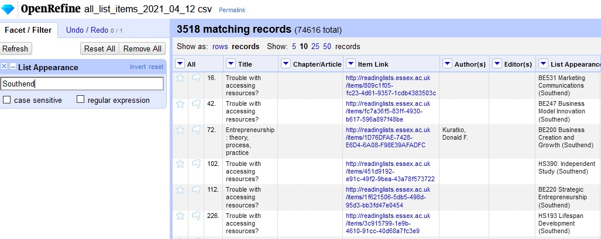
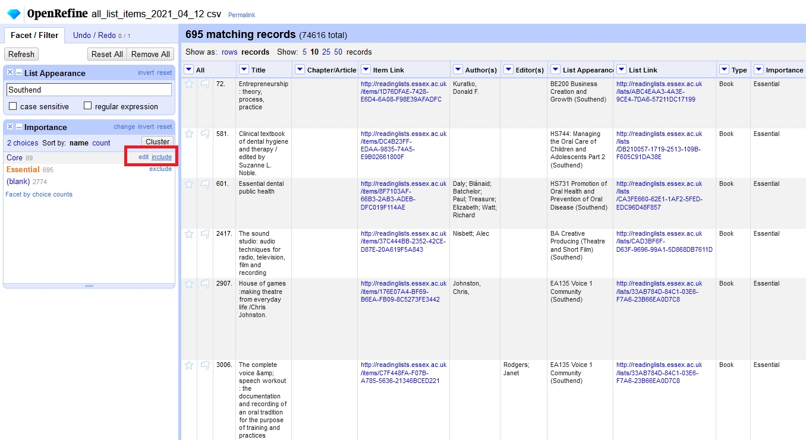
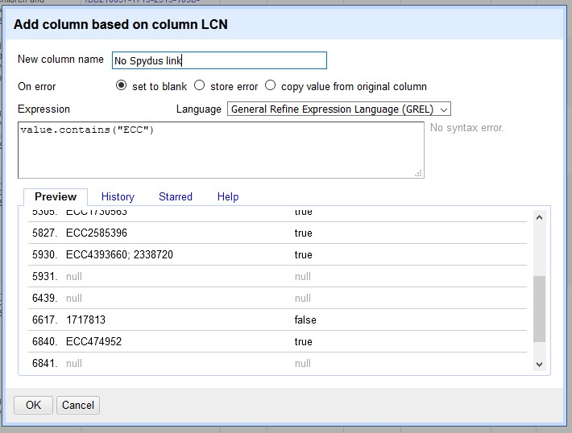

```{r setup, include=FALSE}
knitr::opts_chunk$set(echo = TRUE)
```

# Introduction to OpenRefine

[OpenRefine](https://openrefine.org/) (formerly Google Refine) is a tool for [exploring data](https://youtu.be/B70J_H_zAWM) sets, [cleaning and transforming](https://youtu.be/cO8NVCs_Ba0) it into something useful and [enhancing it](https://youtu.be/5tsyz3ibYzk) into something even more useful. The goal of this guide is to explain the basics of OpenRefine using Talis Aspire data as an example. OpenRefine supports file types like XLS, CSV and MARC so it is very versatile for library workers.

I have been using OpenRefine to proactively find problems in reading lists and fix them procedurally. On the reports tab of Talis reading lists you can export a list of all published items in a comma separated values files. This can be then be imported into OpenRefine. Below I have included a table explaining what each of the fields translates to.
The instructions to install OpenRefine can be found on the [OpenRefine download page](https://openrefine.org/download.html). It supports Windows, Mac and Linux and runs in your web browser. I have had success running it at home and on office computers, if you do not know whether you have Java installed on Windows the version that comes bundled with Java is the easiest way to get started. As most university staff are no longer permitted to install software on campus computers I have requested OpenRefine be to the [University of Essex Software Hub](https://software.essex.ac.uk). This is currently in progress as of September 2021.

## Downloading Talis Aspire data

Data can be downloaded from [Talis Aspire Reports](https://essex.rl.talis.com/reports/523E347F-38CF-E58D-929C-326B7FF25E75.html). For this guide I have been focusing on the All List Items section as my role focuses on checking lists for errors. It is worth bearing in mind that larger data sets require more powerful computers. When I tried to import 603,000 items my computer seized up due to a lack of memory. By default OpenRefine caps out at one gigabyte (GB) of memory, jumping up to 2GB and 4GB allowed me to import the full data set with ease. Instructions on how to do this can be found in the [Using OpenRefine book](https://subscription.packtpub.com/book/big_data_and_business_intelligence/9781783289080/1/ch01lvl1sec15/recipe-7-going-for-more-memory). It is best practice to only work on what you think you need to because actions can get sluggish.

Filtering list status only to only published brings it down to a manageable 129,000. Depending on the status of rollover you may want to filter by Time Period to catch items that are unpublished. Once you have your data click download CSV. This will e.mail the Talis user a link to download the CSV file. For all published items this came out to about 53 megabytes.

## Importing data into Refine

I found searching for the app via the Windows Start menu does not work so you may need to locate the install directory. Double click the OpenRefine icon where you installed it. For me this was C:\\Users\\Spence\\Desktop\\openrefine-3.4.1\\openrefine.exe.  This will open your default web browser to the URL [http://127.0.0.1:3333/](http://127.0.0.1:3333/) this URL only works when the OpenRefine application is running. The home screen should have a browse button to locate the all_list_items_2021_04_12.csv you just downloaded. From there just click next and *Create Project* to start playing around with your data. Once you have created a project it will be visible on the Open Project tab to the left. It saves whatever you’ve done and has a full history.

## Aspire data fields

Below I have included some notes on the fields Talis exposes. If you are familiar with editing reading lists most of this will look familiar but some of these fields are hidden. Knowing what field to filter first is the key to finding the right list items that most need attention.

```{r, echo=FALSE,warning=FALSE,message=FALSE}
library(readr)
library(knitr)
library(kableExtra)
opts <- options(knitr.kable.NA = "")
alllistitemscolumn <- read_csv("alllistitemscolumn.csv")
kable(alllistitemscolumn[1:39, ], caption = "**Table 1.** list items report collumn headers with example fields and notes") %>%
  kable_styling(bootstrap_options = "striped", full_width = FALSE)
```

It has been difficult to detect the precedence of Web Address and Primary Web Address. Need to investigate which field or fields Joe Munzer’s bulk upload tool works on.

# Filtering data

## Text filters

Large data sets are cumbersome. The first thing you might want to do is a simple text filter. It searches the entire column for any cell contains what you type. The great thing about this is that it is interactive so your results update as you type each character. By clicking the arrow left of **List Appearance** and clicking **Filter > Text Filter** File you can now search  for all reading lists that contain the word Southend which for me narrows down to 3518 items. Note the invert toggle on the left side will allow you to search for fields that does not contain your query. You can layer up searches on multiple columns to really drill down on specific issues.

```{r, out.width = "98%", echo=FALSE, fig.align="center", fig.cap="Screenshot of the text filter modifier in OpenRefine. The search filter is Southend and several reading lists taught on the Southend campus are displayed"}

```

## Faceting

Faceting finds commonalities between cells and groups them together, sort of like pivot tables in Excel. On the **Importance** column click facet and perform a text facet. This now allows us to toggle items. I have 695 Essential items and 89 Core items. Clicking Essential or Core will give you one set but if you mouse over additional fields you can include them. For this example include all Core and Essential items.

```{r, out.width = "98%", echo=FALSE, fig.align="center", fig.cap="Screenshot of the facet modifier in OpenRefine. The Essential importance has been isolated and the mouse is hovering over the core field showing the include option."}

```

I have found faceting really useful for finding where the same books are used across multiple reading lists or which list contains the most problems (such as lacking a LCN). If you want to see an example or where it is really powerful try doing it on the **Edition** column.

## Querying a column

Lets say we want to find out which of the essential items taught at Southend do not contain a Southend local control number? To do this we click **LCN > Edit column > Add column based on this column**. Give the new column name a title like No Spydus link. Here we can query the cell value using an expression. The `value.contains()`{.javascript} command will check to see if a cell contains a value and return a true or false. So typing the below line will return false for any essential bookmarks that don’t contain a Southend LCN. 

```javascript
value.contains("ECC")
```

```{r, out.width = "98%", echo=FALSE, fig.align="center", fig.cap="Screenshot of the Add column window in OpenRefine. New column name is \"No Spydus link\", on error is set to blank, expression is value.contains(\"ECC\"). The results show true and false depending on the cell contents"}

```

The preview tab shows a dozen examples in real-time as you type so you can experiment with your expression until you get the desired results. If you have a good filter you may see a variety of results depending on the data.

### Further text faceting

Running another facet on the newly created **No Spydus link** column narrows it down even further. Blank may indicate an essential reading on an external website or a Kortext item that does not yet have a catalogue record yet. A plain LCN may indicate an electronic resource.

As a practice exercise you could try putting in the skills you have learned so far to find a print book that can be found in the Southend Spydus catalogue which is not yet linked correctly on Aspire.

## Regular expressions

Regular expressions are similar to a standard find and replace but they have the ability to include wildcards. Say you wanted to find all papers discussing labour, instead of searching twice for the American English spelling labour you can just use the regular expression labou?r. The question mark indicates the u is optional. Many fields have inconsistencies. They might lack a semicolon or use an & in one bookmark and 'and' in the next. Regular expression is pretty daunting but a lot of the time the hard work is done for you if you to a web search. John Little has an [Intro to RegEx](https://www.johnlittle.info/project/custom/regex/regex.html) which expands on this well.

# Transforming data

## Fixing URLs

One of the simpler tasks but most useful is a find and replace. A common example is a URL that does not contain the University of Essex proxy. Say you have found some unauthenticated DOI.org URLs by running a text filter of “://doi.org/”. In my case I have 101 results on the **Online Resource Web Address** field, so we will work on that one. From browsing the data I find 4 types of leading text:

* https://doi.org/...  
* http://doi.org/... 
* https://dx.doi.org/... 
* http://dx.doi.org/...  

We will tackle the top one first and then modify the expression to cover the others. On the **Online Resource Web Address** column click **Edit Column > Add column based on the column** and use the following GREL expression:

```javascript
value.replace("https://doi.org/", "https://0-doi-org.serlib0.essex.ac.uk/") 
```
If you delete the s in https you can see in real-time how the expression works on different cells. Now if we want to work on more than one type of cell in one go we can chain them using if logic as below.

I have found this technique useful for fixing DOI, HeinOnline, Westlaw URLs and I believe it will be useful for Box of Broadcasts also. Using Joe Munzer's tool allows us to fix hundreds of URLs in one go that would take hours to find and fix by hand. If the library switches to a different proxy service this will come in very useful. One thing I have started doing is including a hashtag in the library note for #openaccess. In the future I do not run the expressions script on open access journals because it would be locking free content behind a login.

# Enhancing data

## Rows vs. records

## Cross command

## Regular expressions

Using the `value.find()`{.javascript} command combined with a regular expression allows you to extract data from a cell. For instance ISBN13s beginning with 978, but might have hyphens or underscores 

```javascript
value.find(/978[_-]?\d{1,3}[_-]?\d{1,3}[_-]?\d{1,3}[_-]?\d{1,4}/)[0]
```

This tries to match all ISBNs. In my trial I got 8911 out of 8936, the other 25 were false positives that just happened to contain 978. From there you can simply find and replace all hyphens and underscores to get clean ISBNs for comparison. I am quite new to regular expressions so there are likely better examples of this online. Don’t waste your time trying to reinvent the wheel unless it helps you understand how regular expressions work. 


## APIs and comparing data sets

There are a number of free and open access resources we can consult to save money when resourcing such as: 

* [OAPEN](https://oapen.org/resources/15635975-metadata) - a managed repository of around 18,000 academic open access  books with strong permanence
* [Directory of Open Access Books](https://www.doabooks.org/en/resources/metadata-harvesting-and-content-dissemination) - links to around 44,000 open access books (incporates the OAPEN list) 
* [Directory of Open Access Journals](https://doaj.org/docs/public-data-dump/) – 16,500 open access peer reviewed journals. 3.5GB of article metadata 
* [Unpaywall](https://unpaywall.org/products/data-feed) - almost 30 million free scholarly articles, based on the Crossref DOI database (85GB) 

You can download these datasets and import them into OpenRefine and run comparison checks on them. As Unpaywall explains the status of open access can change from time to time (usually that older articles become open access) so downloading this data in full is not always the best way to work. A REST API lets you query the live data and you can do this in your browser as below: 

 
[https://library.oapen.org/rest/search?query=9789047420552&expand=metadata](https://library.oapen.org/rest/search?query=9789047420552&expand=metadata)

[https://directory.doabooks.org/rest/search?query=The Politics and Ethics of Representation in Qualitative Research&expand=metadata](https://directory.doabooks.org/rest/search?query=The Politics and Ethics of Representation in Qualitative Research&expand=metadata)

[https://doaj.org/api/v2/search/journals/glossa](https://doaj.org/api/v2/search/journals/glossa)

[https://api.unpaywall.org/v2/10.5114/hm.2018.76078?email=d.spence@essex.ac.uk](https://api.unpaywall.org/v2/10.5114/hm.2018.76078?email=d.spence@essex.ac.uk)

You can search through a range of fields by consulting the API documentation, the above are some useful examples. As these services are free there is often a fair use policy to keep bandwidth costs down. For the resourcing I have done on essential items this is at most the tens of thousands and that has taken a while but been compliant. It is more practical to save the data locally if you are running large queries very regularly. 

If you want to do this on scale you can use it in OpenRefine by concatenating the API strings with data you have in Aspire like DOI or ISBN. 

## Preparing data

# Questions

This guide is a work in progress. I am keen to collaborate on solutions if you think OpenRefine could help with your work. In the bibliography below I have included some links that I found useful while learning OpenRefine and writing this guide. If you have any comments, feedback or suggestions please get in touch with me by [email](mailto:d.spence@essex.ac.uk?subject=OpenRefine for Talis Aspire users).

# Bibliography